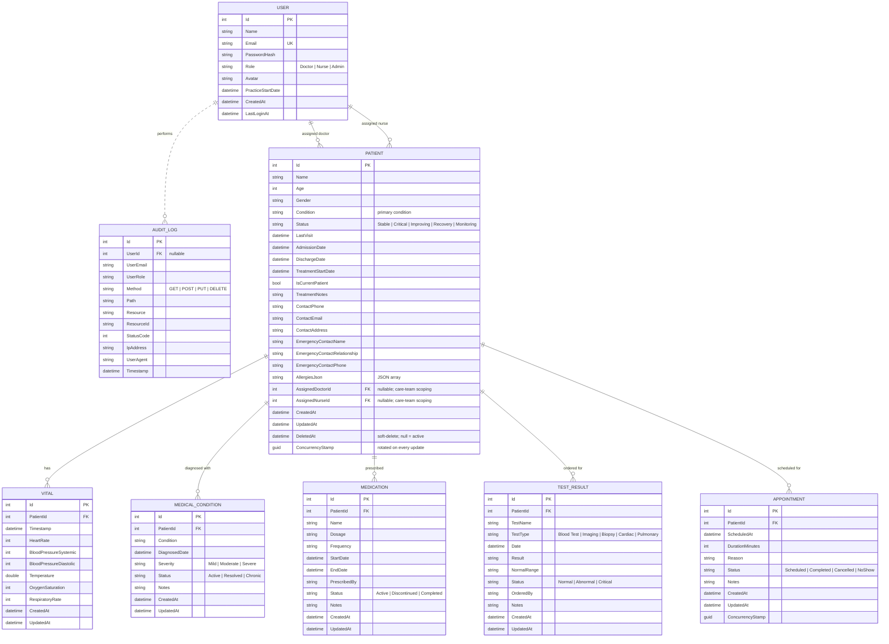

# Entity-Relationship Diagram

The diagram below is generated by hand from the EF Core models in
`backend/Models/`. It is the canonical visual reference for the schema —
update it whenever a new entity or relationship lands.

## Schema overview

## Cardinality and delete behavior

| Parent  | Child             | Cardinality | On Patient delete | Notes |
|---------|-------------------|-------------|-------------------|-------|
| Patient | Vital             | 1 → many    | Cascade           | Soft-delete on Patient hides Vitals via query filter |
| Patient | MedicalCondition  | 1 → many    | Cascade           | Same |
| Patient | Medication        | 1 → many    | Cascade           | Same |
| Patient | TestResult        | 1 → many    | Cascade           | Same |
| Patient | Appointment       | 1 → many    | Cascade           | Same |

`User → AuditLog` is a soft reference — `UserId` is a nullable int with no FK
constraint. Deleting a user does not delete their audit trail; the row keeps
the captured `UserEmail` and `UserRole` strings as a permanent record.

`User → Patient (AssignedDoctor / AssignedNurse)` are real FKs but with
`ON DELETE NO ACTION`. A user cannot be deleted while still assigned to a
patient — operators must explicitly reassign first. Both columns are
nullable so unassigned patients (e.g., emergency intake) are valid.

## Indexes

Documented in `backend/Data/MedicalContext.cs`. Highlights:

- `Patient (Status)`, `(IsCurrentPatient)`, `(Name)`, `(DeletedAt)`, `(AssignedDoctorId)`, `(AssignedNurseId)`
- `Vital (PatientId, Timestamp)` — composite, supports "latest vitals per patient" without sorting
- `Appointment (PatientId, ScheduledAt)` — composite, same idea for the calendar view
- `Medication (PatientId, Status)` — composite
- `TestResult (PatientId, Date)` — composite
- `User (Email)` — unique
- `AuditLog (Timestamp)`, `(UserId)`, `(Resource)` — single-column, covers list views

## Soft-delete behavior

A `DELETE /api/patients/{id}` sets `DeletedAt` rather than removing the row.
Global query filters in `MedicalContext` automatically exclude:

- Patients with `DeletedAt IS NOT NULL`
- Vitals, MedicalConditions, Medications, TestResults, Appointments whose
  parent patient has `DeletedAt IS NOT NULL`

To query soft-deleted rows, call `.IgnoreQueryFilters()` on the relevant DbSet
(e.g., for an admin restore screen).

## Concurrency

`Patient` and `Appointment` carry a `ConcurrencyStamp` (Guid) that EF Core
uses as an optimistic concurrency token. `MedicalContext.SaveChangesAsync`
rotates the stamp on every update, so two concurrent writers fighting over
the same row will see one succeed and the other receive
`DbUpdateConcurrencyException`.

Other entities are simpler and rely on the API's last-write-wins semantics.
